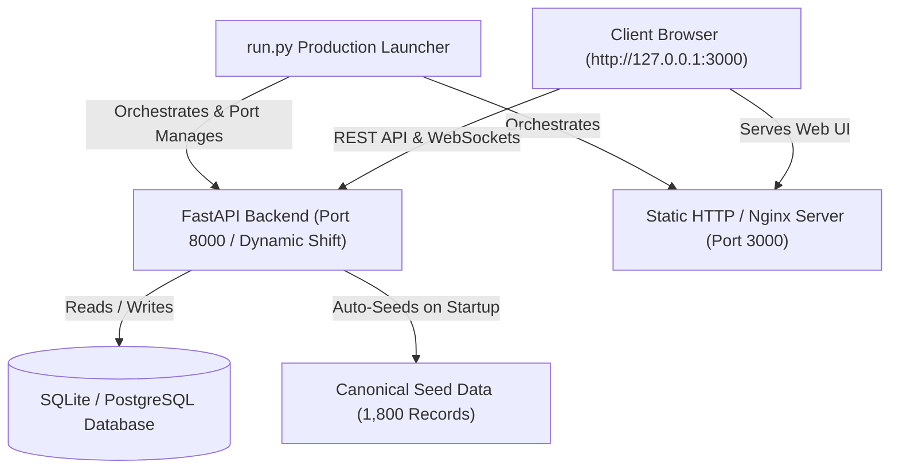

# Unified P&L Intelligence Platform

[](https://fastapi.tiangolo.com)
[](https://www.python.org)
[](https://www.docker.com)
[](https://nginx.org)

An enterprise-grade financial analytics and AI-powered intelligence platform delivering real-time Profit & Loss (P&L) insights, ML anomaly detection, multidimensional forecasting, scenario What-If modeling, automated management recommendations, and natural language copilot explanations.

---

## Architecture Overview



---

## Core Capabilities

- 📊 **Executive & Departmental P&L Dashboards**: Real-time revenue, expense, EBITDA, net margin, and department-level breakdown.
- 🔮 **Multidimensional Forecasting**: Advanced financial forecasting across configurable time horizons and departments.
- 🚨 **Machine Learning Anomaly Detection**: Statistical and ML-driven isolation of revenue/cost irregularities with contextual impact scoring.
- 🤖 **AI Financial Copilot**: Conversational intelligence capable of answering complex financial questions and calculating metric variances.
- 💡 **Scenario & What-If Analysis**: Interactive simulations to model the P&L impact of revenue shifts, OPEX changes, and headcount adjustments.
- 📋 **Executive Reports**: Multi-format report generator (CSV, Excel, PDF) with customizable date ranges and department filters.
- 🔄 **Enterprise Dataset Ingestion**: Robust CSV/Excel parser with schema auto-mapping, validation scoring, and session-based dataset switching.

---

## Repository Structure

```text
P&L system/
│
├── run.py                       # Production launcher with dynamic port management
├── Dockerfile                   # Root Docker container definition
├── docker-compose.yml           # Multi-container orchestration (Backend + Frontend)
├── requirements.txt             # Python runtime requirements
├── README.md                    # Platform documentation
├── .gitignore                   # Production gitignore
├── .env.example                 # Environment configuration template
├── unified_pnl_enterprise_demo.csv  # Canonical sample dataset
├── unified_pnl_enterprise_demo.xlsx # Excel formatted sample dataset
│
├── frontend_v2/                 # Production web frontend
│   ├── dashboard.html           # Main P&L Overview
│   ├── departments.html         # Departmental analysis
│   ├── forecast.html            # Financial forecasting
│   ├── anomalies.html           # Anomaly detection
│   ├── copilot.html             # AI Copilot assistant
│   ├── what-if.html             # What-If scenario modeling
│   ├── reports.html             # Reporting engine
│   ├── datasets.html            # Dataset manager & switcher
│   ├── upload.html              # Spreadsheet upload & schema mapping
│   ├── settings.html            # System & user settings
│   ├── login.html               # Authentication
│   ├── css/                     # Design system stylesheets
│   ├── js/                      # Frontend controllers & API connectors
│   └── assets/                  # Brand assets and icons
│
└── unified-pl-system/
    ├── backend/                 # FastAPI backend service
    │   ├── main.py              # Application entrypoint & lifespan
    │   ├── config.py            # Pydantic settings & environment configuration
    │   ├── database.py          # SQLAlchemy session & database engine
    │   ├── seed.py              # Database initialization & seeding engine
    │   ├── demo_dataset.csv     # Canonical seed data (1,800 records)
    │   ├── requirements.txt     # Backend Python dependencies
    │   ├── core/                # Security, logging, exceptions, dataset context
    │   ├── models/              # SQLAlchemy database models
    │   ├── routers/             # FastAPI API route controllers
    │   ├── services/            # Financial computation & ML engines
    │   ├── schemas/             # Pydantic request/response schemas
    │   └── tests/               # Backend regression & unit test suite
    └── data/
        └── default/             # Default canonical demo dataset storage
```

---

## Quick Start (Local Launch)

### 1. Prerequisites
- **Python 3.11+** installed
- Modern web browser (Chrome, Edge, Firefox, Safari)

### 2. Launch the Application
Run the launcher from the project root:

```bash
python run.py
```

The launcher will automatically:
1. Discover the backend and frontend directories.
2. Verify or initialize the virtual environment with required dependencies.
3. Verify or initialize the database and ensure the canonical dataset is seeded.
4. Detect and cleanly manage ports (defaults: Backend `8000`, Frontend `3000`).
5. Synchronize runtime configuration so the frontend seamlessly connects to the backend.
6. Open your default web browser to the login page.

### 3. Default Credentials
| Field | Value |
| :--- | :--- |
| **Username** | `admin` |
| **Password** | `admin123` |

---

## Launcher Options & Modes

```bash
# Standard Launch
python run.py

# Launch without opening browser
python run.py --no-browser

# Force database re-seed on startup
python run.py --seed

# Self-test startup, readiness, and shutdown
python run.py --self-test

# Specify custom ports
python run.py --backend-port 8001 --frontend-port 3001

# Run environment diagnostics
python run.py --diag
```

---

## Quick Start with Docker

```bash
# Build and start all services
docker compose up --build

# Run in background (detached)
docker compose up -d --build

# Stop all services
docker compose down
```

Services will be available at:
- **Web Application**: [http://localhost:3000](http://localhost:3000)
- **API Documentation (Swagger UI)**: [http://localhost:8000/docs](http://localhost:8000/docs)
- **Health Endpoint**: [http://localhost:8000/api/v1/system/health](http://localhost:8000/api/v1/system/health)

---

## Seeded Dataset & Ingestion Lifecycle

1. **Canonical Seed Dataset**: The application includes a pre-seeded enterprise dataset consisting of 1,800 records across multiple departments (Sales, Marketing, Engineering, Operations, Finance, etc.).
2. **Deterministic Startup**: On fresh installation or server startup, `seed.py` / `main.py` automatically initializes tables and ingests the canonical dataset if not already present.
3. **Uploading New Datasets**:
   - Navigate to **Upload / Datasets** in the navigation sidebar.
   - Drag and drop any financial CSV or Excel (`.xlsx`) file.
   - The platform auto-detects column mappings (Revenue, Expenses, Date, Department, Category).
   - Once finalized, the new dataset is activated for the session.
4. **Dataset Switching**: Switch between uploaded datasets and the canonical seed dataset anytime from the **Datasets** view. On server restart, the application cleanly defaults back to the canonical seed dataset.

---

## Testing & Quality Assurance

### Run Backend Tests (Pytest)
```bash
cd unified-pl-system/backend
pytest tests
```

### Run Self-Test Suite
```bash
python run.py --self-test
```

---

## License

This project is proprietary and confidential. All rights reserved.
