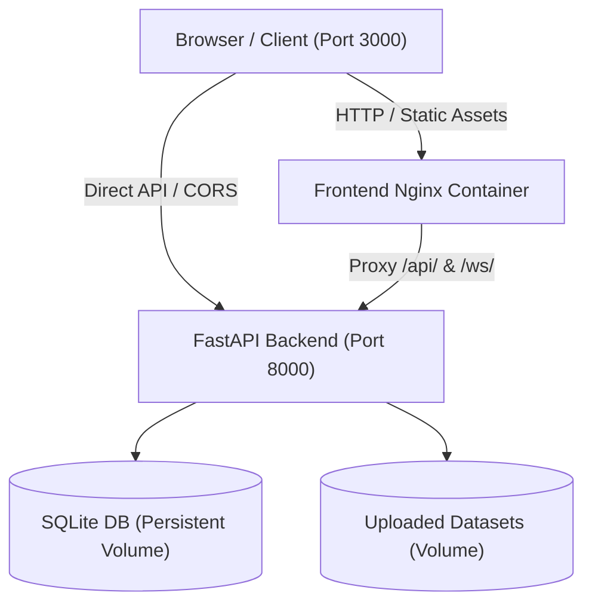

# Unified P&L Intelligence Platform

[](https://github.com)
[](https://fastapi.tiangolo.com)
[](https://www.python.org)
[](https://www.docker.com)
[](#)

An enterprise financial analytics and AI-powered intelligence platform delivering real-time Profit & Loss (P&L) insights, anomaly detection, multidimensional forecasting, scenario what-if modeling, and natural language copilot explanations.

---

## Key Features

- **Executive & Departmental Dashboards**: High-level KPIs, revenue/expense breakdowns, EBITDA margins, and departmental health metrics (Retail, Corporate, Investment, SME).
- **ML Anomaly Detection**: Unsupervised anomaly detection with contamination tuning, variance analysis, and root cause classification.
- **Multidimensional Forecasting**: Historical trend extrapolation and AI forecasting across operational domains.
- **Dynamic Dataset Pipeline**: Upload CSV/Excel financial datasets with automatic schema mapping, data validation, and instantaneous dynamic recalculation across all dashboard modules.
- **What-If Scenario Simulation**: Real-time revenue and cost sensitivity modeling with visual impact projections.
- **Financial Copilot & AI Insights**: Natural language query interface and automated narrative executive reports.
- **Role-Based Access Control (RBAC)**: JWT-based authentication supporting Admin, Analyst, Manager, and Viewer roles.

---

## Architecture Overview



---

## Requirements

### Local Environment
- **Python**: 3.11 or higher
- **Browser**: Modern web browser (Chrome, Edge, Firefox, Safari)

### Docker Environment
- **Docker Engine**: 20.10+
- **Docker Compose**: v2.0+

---

## Quick Start & Running

### Option A: Local Development (Python)

1. **Clone the repository**:
   ```bash
   git clone <repository-url>
   cd "P&L system"
   ```

2. **Run the all-in-one launcher**:
   ```bash
   python run.py
   ```
   *The launcher automatically discovers backend and frontend paths, verifies packages, loads default settings, runs safe database migrations/seeding, starts backend and frontend servers, and validates readiness.*

3. **Access the application**:
   - **Frontend**: [http://localhost:3000/login.html](http://localhost:3000/login.html)
   - **Backend API**: [http://localhost:8000](http://localhost:8000)
   - **Swagger Docs**: [http://localhost:8000/docs](http://localhost:8000/docs)
   - **Health Endpoint**: [http://localhost:8000/health](http://localhost:8000/health)

---

### Option B: Docker Deployment (Recommended)

1. **Build and start the containers**:
   ```bash
   docker compose up --build
   ```

2. **Access the application**:
   - **Frontend**: [http://localhost:3000](http://localhost:3000)
   - **Backend API**: [http://localhost:8000](http://localhost:8000)
   - **Swagger Docs**: [http://localhost:8000/docs](http://localhost:8000/docs)
   - **Health Check**: [http://localhost:8000/health](http://localhost:8000/health)

3. **Stop the containers**:
   ```bash
   docker compose down
   ```

---

## Default Credentials

The platform is initialized on first boot with safe default administrator credentials:

| Role | Username | Password |
| :--- | :--- | :--- |
| **Administrator** | `admin` | `admin123` |

---

## Environment Configuration

Configuration is managed via environment variables. Create a `.env` file in `unified-pl-system/backend/.env` or root:

```ini
# Database Configuration
DATABASE_MODE=sqlite
DATABASE_URL=sqlite:///./enterprise_pl.db

# Security
SECRET_KEY=change-this-to-a-secure-secret-key-in-production
ALGORITHM=HS256
ACCESS_TOKEN_EXPIRE_MINUTES=30
REFRESH_TOKEN_EXPIRE_DAYS=7

# CORS Allowed Origins (comma-separated)
ALLOWED_ORIGINS=http://localhost:3000,http://127.0.0.1:3000,http://localhost:8000,http://127.0.0.1:8000

# Optional AI Features API Keys
OPENAI_API_KEY=
GEMINI_API_KEY=

# Anomaly Contamination Rates
CONTAM_RETAIL=0.03
CONTAM_CORPORATE=0.05
CONTAM_INVESTMENT=0.08
CONTAM_SME=0.04
```

See `.env.example` for full reference.

---

## Database & Data Persistence

- **Engine**: SQLite with WAL (Write-Ahead Logging) mode and thread concurrency controls.
- **Docker Persistence**: The SQLite database file (`/app/data/enterprise_pl.db`) and uploaded binary datasets (`/app/uploads/`) are mounted to named Docker volumes (`unified_pl_data` and `unified_pl_uploads`).
- **Data Safety**: All records, uploaded datasets, custom mappings, and users persist safely across container restarts (`docker compose down` -> `docker compose up`).
- **Safe Seeding**: `seed.py` runs idempotently on launch, guaranteeing the default admin user and canonical demo dataset exist without overwriting or destroying user-created datasets or accounts.

---

## API Documentation & Endpoints

Interactive Swagger UI documentation is available at `http://localhost:8000/docs`.

### Key Endpoints:
- `GET /health` & `GET /api/v1/system/health`: System health and uptime
- `POST /api/v1/auth/login`: Authenticate and receive JWT access token
- `GET /api/v1/pl/summary`: Aggregate KPIs, revenue, expenses, and net profit
- `GET /api/v1/pl/departments/summary`: Department-level P&L breakdowns
- `GET /api/v1/pl/forecast`: Multi-period financial forecasting
- `GET /api/v1/anomalies/`: Identified financial anomalies and confidence scores
- `POST /api/v1/pl/upload`: Upload CSV/Excel dataset
- `GET /api/v1/datasets/recent`: List all uploaded datasets and active dataset ID

---

## Troubleshooting

### Port Conflicts (3000 / 8000)
If ports 3000 or 8000 are already bound:
- **Local (`run.py`)**: The launcher will automatically detect and cleanly terminate stale processes occupying the ports.
- **Docker**: Modify host port mappings in `docker-compose.yml` (e.g. `"3001:80"` and `"8001:8000"`).

### Resetting Database
To reset the database back to clean state:
- **Local**: Delete `unified-pl-system/backend/enterprise_pl.db` and rerun `python run.py`.
- **Docker**: Run `docker compose down -v` to purge named volumes and restart.

---

## License

Proprietary enterprise financial analytics platform. All rights reserved.
