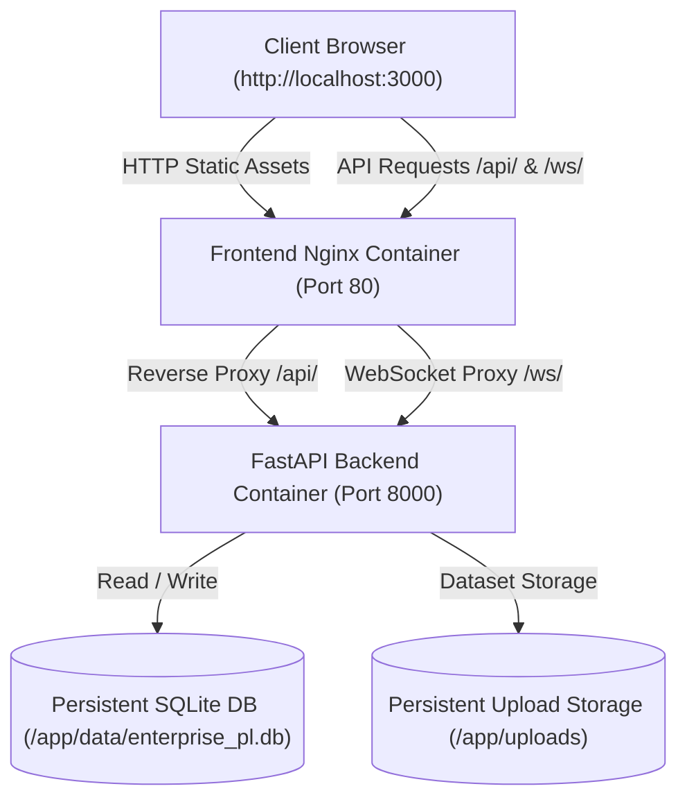

# Unified P&L Intelligence Platform

[](https://fastapi.tiangolo.com)
[](https://www.python.org)
[](https://www.docker.com)
[](https://nginx.org)
[](#)

An enterprise financial analytics and AI-powered intelligence platform delivering real-time Profit & Loss (P&L) insights, ML anomaly detection, multidimensional forecasting, scenario what-if modeling, management recommendations, and natural language copilot explanations.

---

## Architecture Overview



---

## Requirements

- **Docker Deployment (Recommended)**:
  - [Docker Desktop](https://www.docker.com/products/docker-desktop/) (Windows / macOS) or Docker Engine + Docker Compose (Linux)
  - *No local Python, pip, Node.js, or virtual environment required.*
- **Local Developer Mode**:
  - Python 3.11+
  - Chrome / Edge / Firefox

---

## Quick Start with Docker (Recommended)

### 1. Clone the repository
```bash
git clone <repository-url>
cd "P&L system"
```

### 2. Build and run containers
```bash
docker compose up --build
```
*To run in the background (detached mode):*
```bash
docker compose up -d --build
```

### 3. Open the application
- **Web Application**: [http://localhost:3000](http://localhost:3000)
- **Interactive API Documentation (Swagger)**: [http://localhost:8000/docs](http://localhost:8000/docs)
- **API Health Check**: [http://localhost:8000/api/v1/system/health](http://localhost:8000/api/v1/system/health) or [http://localhost:3000/health](http://localhost:3000/health)

---

## Default Demo Credentials

The platform automatically creates a default administrator user and canonical enterprise demo dataset on first startup:

| Role | Username | Password |
| :--- | :--- | :--- |
| **Administrator** | `admin` | `admin123` |

---

## Useful Docker Commands

| Action | Command |
| :--- | :--- |
| **Start with build** | `docker compose up --build` |
| **Start in background** | `docker compose up -d --build` |
| **View combined logs** | `docker compose logs -f` |
| **View backend logs** | `docker compose logs -f backend` |
| **View frontend logs** | `docker compose logs -f frontend` |
| **Check container status** | `docker compose ps` |
| **Restart containers** | `docker compose restart` |
| **Stop containers** | `docker compose down` |
| **Clean reset (purge volumes)** | `docker compose down -v` |

---

## Database & Data Lifecycle

- **Non-Destructive Initialization**: On container start, `seed.py` creates any missing database tables and verifies the presence of the default demo dataset and admin credentials.
- **Data Persistence**: The SQLite database file (`/app/data/enterprise_pl.db`) and uploaded files (`/app/uploads/`) are stored in named Docker volumes (`unified_pl_data` and `unified_pl_uploads`), ensuring data survives `docker compose down` and restarts.
- **Clean Reset**: Running `docker compose down -v` removes persistent volumes so the next `docker compose up` starts completely fresh with canonical seed data.

---

## Local Development Mode (Without Docker)

If you prefer running directly on your host machine with Python:

1. **Install dependencies**:
   ```bash
   pip install -r unified-pl-system/backend/requirements.txt
   ```
2. **Start the platform**:
   ```bash
   python run.py
   ```
3. Open [http://localhost:3000](http://localhost:3000).

---

## Environment Variables

Copy `.env.example` to `.env` to customize settings:

```ini
APP_ENV=development
HOST=0.0.0.0
PORT=8000
BACKEND_PORT=8000
FRONTEND_PORT=3000

DATABASE_MODE=sqlite
DATABASE_URL=sqlite:////app/data/enterprise_pl.db

SECRET_KEY=supersecretkey-unified-pl-2025-change-this-in-production
ALGORITHM=HS256
ACCESS_TOKEN_EXPIRE_MINUTES=60
REFRESH_TOKEN_EXPIRE_DAYS=7
ALLOWED_ORIGINS=http://localhost:3000,http://127.0.0.1:3000,http://localhost:8000,http://127.0.0.1:8000

# Optional AI API keys
GEMINI_API_KEY=
OPENAI_API_KEY=

ENABLE_COPILOT=true
ENABLE_FORECAST_ENGINE=true
ENABLE_RECOMMENDATIONS=true
ENABLE_NOTIFICATIONS=true
```

---

## Troubleshooting

### Port Conflicts (3000 or 8000 already in use)
If port 3000 or 8000 is occupied on your machine, adjust the host port mappings in `docker-compose.yml` or your `.env`:
```ini
FRONTEND_PORT=3001
BACKEND_PORT=8001
```

### Checking Startup Logs
If containers do not start immediately, inspect logs:
```bash
docker compose logs backend
```

---

## License

Proprietary enterprise financial intelligence platform. All rights reserved.
