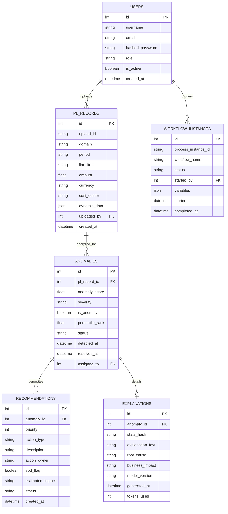

# Architecture

This document describes the high-level architecture of the Unified P&L Analytics Platform.

## Core Components
- **Frontend**: Vanilla HTML/JS/CSS focusing on high-performance rendering, styled with a modern glassmorphic design system.
- **Backend API**: FastAPI framework serving REST APIs, structured using the Repository pattern.
- **Database**: PostgreSQL storing user data, P&L records, detected anomalies, and workflow executions.
- **AI Engine**: 
  - *Scikit-Learn (Isolation Forest)*: Synchronous anomaly detection.
  - *Google Gemini*: Asynchronous conversational copilot for anomaly explanation.

## Entity Relationship Diagram

## System Flow
1. User uploads a CSV of financial records.
2. The Backend parses the file and saves raw `PL_RECORDS` to the DB.
3. The AI Engine asynchronously evaluates the batch of records for anomalies.
4. If an anomaly is found, it is persisted in the `ANOMALIES` table.
5. The UI fetches anomalies and can trigger the Copilot Explanation endpoint to receive human-readable AI analysis via Gemini.
