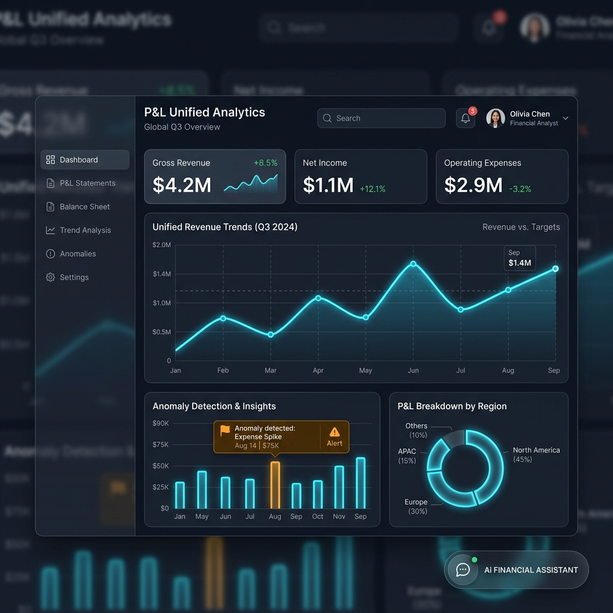

# Unified P&L Analytics Platform



An enterprise-grade platform for financial analytics, anomaly detection, and Copilot explanations. 
Built with FastAPI, PostgreSQL, and a vanilla JS/CSS frontend.

## Features
- **P&L Data Ingestion**: Securely upload and parse financial data via CSV/Excel.
- **AI Anomaly Detection**: Uses Isolation Forests via Scikit-Learn to detect financial discrepancies in real-time.
- **Workflow Orchestration**: Camunda BPMN definitions for scalable background tasks.
- **Copilot Explanations**: Gemini-powered explanations of anomalies to understand business impact.
- **Enterprise UI**: Glassmorphism, responsive design, and robust Toast notifications.
- **Production Ready**: Full Docker support and optimized deployment configs for Render (Backend) and Vercel (Frontend).

## Quickstart

### Prerequisites
- Python 3.11+
- PostgreSQL 15+
- Node.js (Optional, if using npm tools in the future)

### Local Setup
1. Clone the repository
2. Set up a virtual environment:
   ```bash
   python -m venv venv
   source venv/bin/activate
   ```
3. Install dependencies:
   ```bash
   pip install -r backend/requirements.txt
   ```
4. Configure `.env` file with your `DATABASE_URL` and `GEMINI_API_KEY`.
5. Run migrations:
   ```bash
   cd backend
   alembic upgrade head
   ```
6. Start the development server:
   ```bash
   uvicorn main:app --reload
   ```

## Architecture
See [ARCHITECTURE.md](ARCHITECTURE.md) for detailed diagrams and system flow.

## Deployment
See [DEPLOYMENT.md](DEPLOYMENT.md) for instructions on deploying to Render and Vercel.

## Testing
The backend relies on Pytest for testing:
```bash
pytest -v --cov=. --cov-report=term-missing tests/
```
